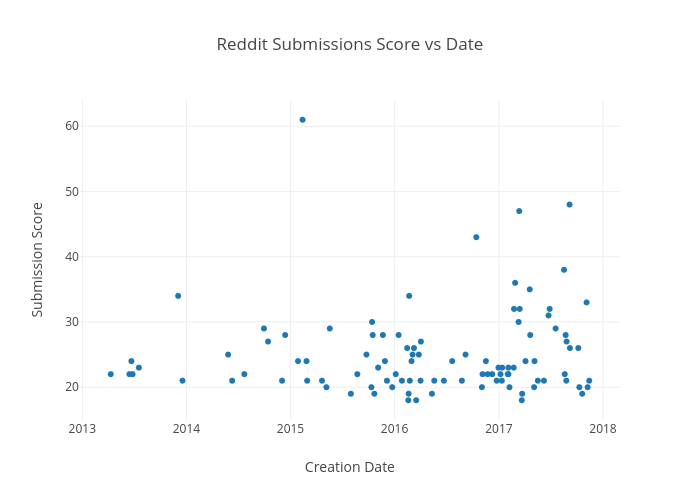

# Web Scraping Projects
This repository contains my projects from an upper level undergraduate class in Python on data oriented programming and retreiving information from the web.

# Content
### [Subreddit Posts](https://github.com/adambens/Web_Scraping_Projects/tree/master/Subreddits)
Subreddit popularity: Looking at the creation date and submission score of the most popular posts in a user entered subreddit 

### [Facebook Events](https://github.com/adambens/Web_Scraping_Projects/tree/master/Facebook%20Events%20Scraper)
Mapping Facebook Events: Looking at the location of facebook events that match a user entered query. 

### [New York Times Articles Wordcloud]()  
New York Times Wordcloud: Matches articles based on a user entered query and constructs a wordcloud of the most popular words in the first 100 articles matching the query.

# Requirements

INSTRUCTIONS: 
Required: Reddit account, Facebook account, NYT API Key 
Required Libraries: pandas, basemap, matplotlib, praw, wordcloud, plot.ly 

Get NYT API KEY from : http://developer.nytimes.com/  
Get Reddit Token Information : https://github.com/reddit/reddit/wiki/OAuth2  
Get Facebook API  User Access Token: https://developers.facebook.com/docs/facebook-login/access-tokens/  

# Documentation 
Documentation for Reddit:
https://www.reddit.com/dev/api  
https://github.com/praw-dev/praw   
http://praw.readthedocs.io/en/latest/code_overview/reddit_instance.html   

Documentation for Facebook:  
http://facebook-sdk.readthedocs.io/en/latest/api.html   
https://developers.facebook.com/docs/graph-api   

Documentation for New York Times: 
https://developer.nytimes.com/article_search_v2.json#/Console/GET/articlesearch.json  
http://developer.nytimes.com/#h3-facets-working  

Documentation for wordcloud: 
https://github.com/amueller/word_cloud  
https://amueller.github.io/word_cloud/generated/wordcloud.WordCloud.html  

Documentation for basemap: 
http://matplotlib.org/basemap/  
https://matplotlib.org/users/colors.html  

Documentation for plot.ly: 
https://plot.ly/python/time-series/ 

Documentation for pandas: 
http://pandas.pydata.org/pandas-docs/stable/visualization.html#bar-plots  
http://nbviewer.jupyter.org/github/jvns/pandas-cookbook/blob/master/cookbook/Chapter%209%20-%20Loading%20data%20from%20SQL%20databases.ipynb  
